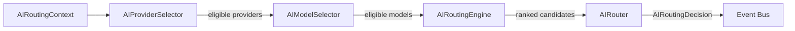

# @infrashield/ai-routing

The **Intelligent Routing Engine** for the Agentic OS AI Gateway.

Applications never choose a provider or model directly. They describe what
they need through an `AIRoutingContext`, and the `AIRouter` deterministically
selects the best available provider/model pairing from the AI Gateway's
provider and model registries, using live health data and an explicit,
policy-driven scoring model.

This package is **provider-agnostic**: it never imports a provider SDK, calls
an external API, or hardcodes logic for any specific vendor (OpenAI,
Anthropic, Gemini, Ollama, etc.). It only reasons over the `IAIProvider` /
`IAIModel` contracts exposed by `@infrashield/ai-core`.

## Selection process

Routing a request runs through four composable, dependency-injected stages:



1. **`AIProviderSelector`** filters the provider registry down to providers
   that satisfy the policy's allow/deny lists, allowed regions, data
   residency and confidential-workload rules, the request's environment, the
   required capability, any requested feature flags (vision, streaming,
   tool-calling, embeddings, structured output, reasoning), and current
   health (unhealthy providers are rejected; degraded providers are rejected
   only if they violate the policy's latency SLA).
2. **`AIModelSelector`** filters the model registry, scoped to only the
   providers that survived step 1, rejecting deprecated/unavailable models,
   models missing the required capability or feature flags, and models whose
   context window is smaller than `context.minContextTokens`.
3. **`AIRoutingEngine`** builds every remaining provider/model pairing,
   applies hard constraints (`context.maxLatencyMs`, `context.maxCost`,
   `policy.maxCost`), scores each surviving candidate according to the
   configured `AIRoutingStrategy` and policy preferences/rules, and returns a
   deterministic ranking.
4. **`AIRouter`** picks the top-ranked candidate, builds a fallback plan from
   the remaining candidates, detects whether a policy-preferred fallback
   provider had to be skipped, and publishes the routing events described
   below.

Every rejection at every stage is captured as an `AIRejectedCandidate`
(`providerId`, optional `modelId`, and an `AISelectionReason`) and surfaced on
`AIRoutingDecision.rejectedCandidates` — nothing is silently dropped.

## Usage

```ts
import {
  AIRouter,
  AIRoutingContext,
  AIRoutingPolicy,
  AIRoutingStrategy,
} from '@infrashield/ai-routing';

const router = new AIRouter({
  providerRegistry,
  modelRegistry,
  policy: new AIRoutingPolicy({ strategy: AIRoutingStrategy.balanced() }),
  eventBus, // optional, implements IEventBus from @infrashield/core-infrastructure
});

const result = await router.route(
  new AIRoutingContext({
    requestId: 'req-123',
    requiredCapability: 'chat',
    vision: true,
    maxLatencyMs: 500,
    maxCost: 0.5,
    region: 'us',
  }),
);

console.log(result.decision.providerId, result.decision.modelId);
console.log(result.decision.reasons);
console.log(result.fallbackPlan); // ordered list of fallback provider ids
```

## Routing context

`AIRoutingContext` is the full description of what a request needs:

| Field                                                                               | Purpose                                                                     |
| ----------------------------------------------------------------------------------- | --------------------------------------------------------------------------- |
| `requiredCapability` / `preferredCapability`                                        | Capability the provider/model must (or should) support                      |
| `reasoning`, `vision`, `streaming`, `toolCalling`, `embeddings`, `structuredOutput` | Feature-flag requirements                                                   |
| `maxLatencyMs`, `maxCost`, `minContextTokens`                                       | Hard numeric constraints — violations are hard-rejected, not just penalized |
| `tenantId`, `classification`, `region`, `environment`                               | Governance/routing metadata (e.g. `classification: 'confidential'`)         |
| `preferredProviders`, `preferredModelFamily`                                        | Soft preferences that influence scoring                                     |

## Policies

`AIRoutingPolicy` centralizes governance rules applied to every request:

- `preferredProviders` / `deniedProviders` / `allowedProviders`
- `allowedRegions` / `dataResidency`
- `confidentialWorkloads` — require confidential-capable providers when the
  request is classified `confidential` or `restricted`
- `maxCost` / `latencySlaMs` — policy-wide cost and latency ceilings
- `preferredModelFamily`
- `fallbackOrder` / `maxFallbacks` — ordered fallback plan and its size limit
- `rules: AIRoutingRule[]` — custom predicates over the context that add
  scoring preferences (`preferredProvider`, `preferredModel`,
  `preferredModelFamily`, `penalty`) when matched

Policies validate themselves at construction time and throw
`AIRoutingPolicyException` for contradictory configuration (e.g. a provider
in both `allowedProviders` and `deniedProviders`, an empty `allowedProviders`
list, or negative cost/latency thresholds).

## Strategies

`AIRoutingStrategy` selects how surviving candidates are scored:

| Factory                             | Behavior                                                          |
| ----------------------------------- | ----------------------------------------------------------------- |
| `capabilityFirst()`                 | Weight capability match above all else                            |
| `lowestLatency()`                   | Prefer the lowest estimated latency                               |
| `lowestCost()`                      | Prefer the lowest estimated cost                                  |
| `highestAvailability()`             | Prefer the highest provider availability                          |
| `preferredProvider(providerId)`     | Strongly prefer a specific provider                               |
| `preferredModelFamily(family)`      | Strongly prefer a specific model family                           |
| `balanced()`                        | Blend capability, latency and cost                                |
| `enterprisePolicy()`                | Weight policy rules and governance constraints heavily            |
| `custom(name, description, scorer)` | Fully custom `(candidate: AISelectionCandidate) => number` scorer |

Regardless of strategy, ties are broken deterministically: score (desc),
then latency (asc), then cost (asc), then model id (alphabetical).

## Decision model

`AIRoutingResult` is returned from `router.route(context)`:

- `decision: AIRoutingDecision` — `providerId`, `modelId`, `reasons`,
  `estimatedLatencyMs`, `estimatedCost`, `confidence`, `rejectedCandidates`,
  `appliedPolicies` (which policy fields were in effect),
  `appliedConstraints` (which context constraints were in effect)
- `appliedRules: AIRoutingRule[]` — policy rules whose predicate matched
- `fallbackPlan: string[]` — ordered fallback provider ids, honoring
  `policy.fallbackOrder` and `policy.maxFallbacks`

`router.snapshot()` returns an immutable `AIRoutingSnapshot` with
`decisionCount`, `providerUsage`, `modelUsage`, `policyUsage` and
`fallbackCount`, useful for observability dashboards.

## Events

When constructed with an `eventBus` (any `IEventBus` from
`@infrashield/core-infrastructure`), `AIRouter` publishes, in order:

1. `ProviderSelectedEvent`
2. `ModelSelectedEvent`
3. `RoutingPolicyAppliedEvent` (only if one or more rules matched)
4. `FallbackTriggeredEvent` (only if the policy's preferred fallback
   provider was unavailable and a substitute had to be used)
5. `RoutingDecisionCreatedEvent` (always published last)

## Errors

| Exception                      | Thrown when                                                                 |
| ------------------------------ | --------------------------------------------------------------------------- |
| `AIProviderSelectionException` | No provider satisfies the request/policy                                    |
| `AIModelSelectionException`    | Providers exist, but no model satisfies the request/policy                  |
| `AISelectionException`         | Candidates exist, but every pairing is rejected by engine-level constraints |
| `AIRoutingPolicyException`     | An `AIRoutingPolicy` is constructed with contradictory or invalid settings  |

All exceptions extend `AIRoutingException` and carry the rejected candidates
as `cause` for debugging.

## Determinism & thread safety

Given the same registries, policy and context, `AIRouter.route()` always
returns the same decision. There are no random tie-breaks and no implicit
retries against external providers — `AIRouter` only ranks candidates that
the caller's own registries expose. Concurrent `route()` calls are safe:
internal usage counters are updated synchronously between `await` points, so
snapshots accumulate correctly under concurrent load.
